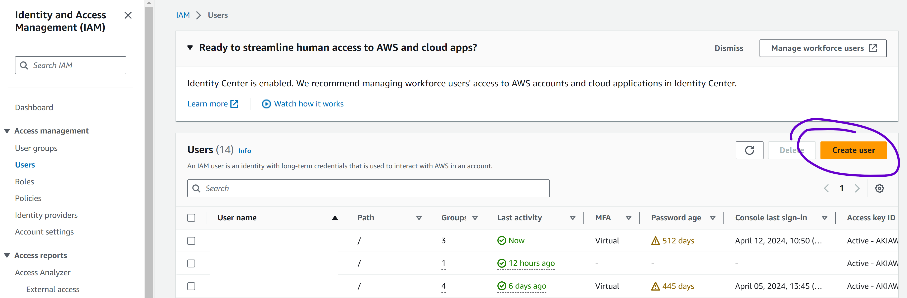

# React Monorepo Template

## Create user for deployment (AWS)

1. Go to IAM service
2. Click Users --> `Create User`

   

3. Fill the user name and click on `Next`
4. Click `Attach policies directly`, click on `AdministratorAccess` and click on `Next`
5. Click on `Create user`
6. View the created user.
7. Click on the tab `Security credentials` and click on `Create access key`
8. Click on the option `Command Line Interface (CLI)` and click on `Next`
9. Click on the button `Create access key`
10. Copy the keys `Access key` and `Secret access key`

## Useful information if you fork this monorepo

### Package lock is git ignored

Intended in order to avoid merge conflicts on this repo

**Don't forget to remove it from git ignore!**. Package versions should always be defined specifically (without the simbol ^). This ensures that even if the lock is deleted, same versions would be reinstalled.

Having the lock inside your repo is useful for CI package caching and to avoid version diff on fresh install.

### Github workflow is deactivated

We don't want to trigger the workflow here, but you probably want to.
You should rename the .github/workflows-off folder to **.github/workflow**
